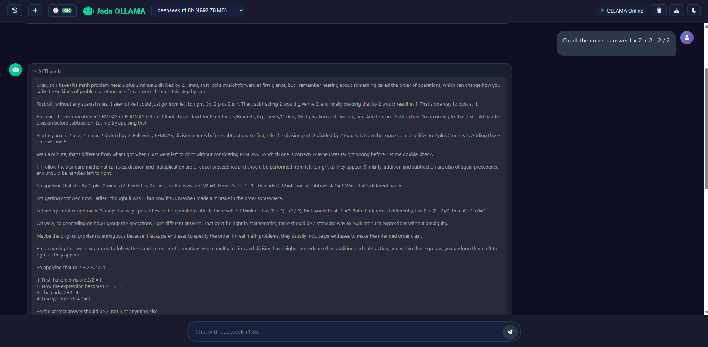
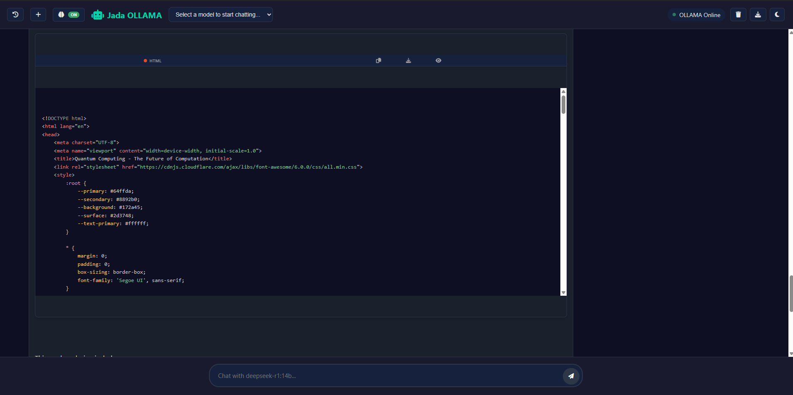
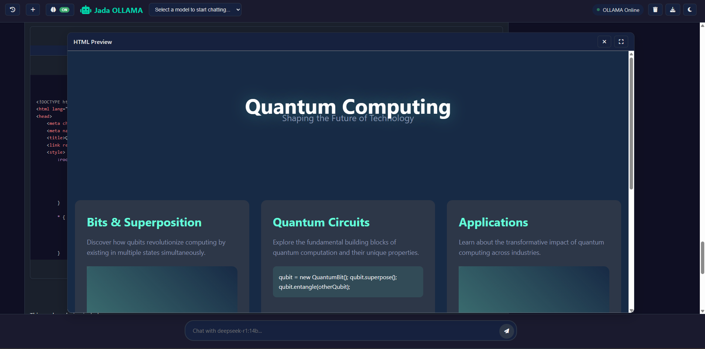
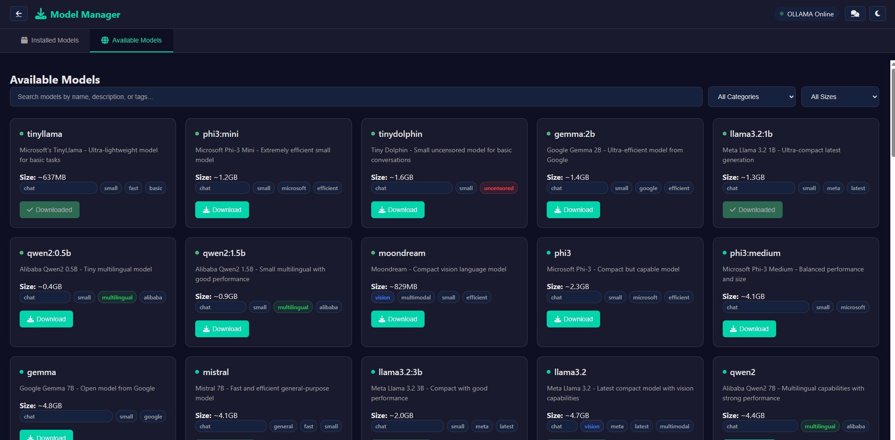

# Jada Ollama - AI Chat Platform

<div align="center">

[](https://youtu.be/VM-Fvworq4U)

<a href="https://youtu.be/VM-Fvworq4U">
  
</a>


**A Modern, Feature-Rich Web Interface for Ollama AI Models**

*Developed by JadaDev with AI Assistance*

[](https://opensource.org/licenses/MIT)
[](https://php.net)
[](https://developer.mozilla.org/en-US/docs/Web/JavaScript)
[](https://ollama.ai)

</div>

## 🎯 Overview

Jada Ollama is a sophisticated, open-source web interface designed to provide seamless interaction with Ollama AI models. Built with modern web technologies, it offers an intuitive chat experience with advanced features like code execution, syntax highlighting, and comprehensive model management.

## ✨ Key Features

### 🤖 AI Chat Interface
- **Real-time conversations** with Ollama AI models
- **Dynamic model selection** with live switching capabilities
- **Memory management** with persistent conversation context
- **Intelligent response formatting** with markdown support



### 💻 Advanced Code Features
- **Multi-language code execution** (Python, JavaScript, PHP, Bash)
- **Syntax highlighting** with Prism.js integration
- **One-click code execution** directly from chat messages
- **Live code preview** for HTML/CSS/JavaScript
- **Secure sandboxed execution** with timeout protection



### 🎨 Modern User Experience
- **Responsive design** optimized for all devices
- **Dark/Light theme** toggle with system preference detection
- **Chat history management** with persistent storage
- **Export functionality** for saving conversations
- **Professional UI/UX** with smooth animations



### 🔧 Model Management
- **Real-time model discovery** from Ollama server
- **Model status monitoring** with live connection indicators
- **Easy model switching** without losing conversation context
- **Performance optimization** for different model types



## 🚀 Quick Start

### Prerequisites
- **Web Server**: Apache/Nginx with PHP 7.4+
- **Ollama**: Running locally on port 11434
- **Optional**: Python, Node.js for enhanced code execution

### Installation
1. **Download/Clone** the project to your web server directory
2. **Start Ollama** service on your local machine:
   ```bash
   ollama serve
   ```
3. **Pull some models** (optional):
   ```bash
   ollama pull llama2
   ollama pull codellama
   ollama pull deepseek-coder
   ```
4. **Access** the application through your web browser
5. **Select a model** and start chatting!

## 🛠️ Technical Architecture

### Frontend Technologies
- **HTML5/CSS3** with modern flexbox/grid layouts
- **Vanilla JavaScript** with ES6+ features
- **Prism.js** for syntax highlighting
- **KaTeX** for mathematical expressions
- **Font Awesome** for icons

### Backend Components
- **PHP** for server-side API handling
- **RESTful API** design for Ollama communication
- **Secure code execution** with temporary file handling
- **JSON-based** data exchange

### File Structure
```
├── index.php           # Main application interface
├── main.js            # Core JavaScript functionality
├── styles.css         # Application styling
├── ollama_api.php     # Ollama API communication
├── python_runner.php  # Code execution engine
├── preview.php        # Live code preview
└── dl.php             # File download handler
```

## 🎨 Customization

### Theme Configuration
The application supports extensive theming through CSS variables:

```css
:root {
  --accent: #00d4aa;        /* Primary accent color */
  --bg-primary: #0f0f23;    /* Main background */
  --text-primary: #e6e6e6;  /* Primary text color */
  --message-bg: #1a1a2e;    /* Message background */
  --code-bg: #16213e;       /* Code block background */
}
```

### Feature Toggles
Customize functionality by modifying configuration in `main.js`:
- Memory management settings
- Code execution timeout limits
- Theme preferences
- Model refresh intervals

## 🔒 Security Features

### Code Execution Safety
- **10-second execution timeout** to prevent infinite loops
- **Pattern filtering** to block dangerous operations
- **Sandboxed environment** with temporary file isolation
- **Resource limitation** to prevent system overload

### Blocked Operations
For security, the following operations are restricted:
- File system read/write operations
- System command execution
- Network operations
- Import of potentially dangerous modules

## 📖 Usage Guide

### Basic Chat Operations
1. **Model Selection**: Choose from available Ollama models in the dropdown
2. **Send Messages**: Type your message and press Enter or click send
3. **View Responses**: AI responses appear with proper formatting and syntax highlighting
4. **Memory Toggle**: Enable/disable conversation memory as needed

### Advanced Features
- **Code Execution**: Click "Run" on code blocks to execute them
- **Chat Export**: Download conversations as text files
- **History Management**: Access previous chats from the sidebar
- **Theme Switching**: Toggle between dark and light modes
- **Live Preview**: View HTML/CSS/JavaScript code in real-time

## 🤝 Development & Contributions

### AI-Assisted Development
This project was developed with significant assistance from various AI models:
- **Claude** (Anthropic) - Architecture design and code optimization
- **Gemini** (Google) - Feature implementation and debugging
- **ChatGPT** (OpenAI) - UI/UX improvements and documentation
- **DeepSeek** - Code analysis and performance optimization
- **LLaMA** - Testing and validation support

### Contributing
We welcome contributions from the community! To contribute:
1. Fork the repository
2. Create a feature branch
3. Make your changes with proper documentation
4. Test thoroughly across different browsers
5. Submit a pull request with detailed description

### Development Setup
```bash
# Clone the repository (when available)
git clone https://github.com/JadaDev/jada-ollama.git

# Navigate to project directory
cd jada-ollama

# Start your local web server
# For PHP built-in server:
php -S localhost:8000

# Ensure Ollama is running
ollama serve
```

## 🐛 Troubleshooting

### Common Issues

**Ollama Connection Problems**
- Verify Ollama service is running: `ollama serve`
- Check port 11434 accessibility
- Ensure firewall allows local connections

**Code Execution Failures**
- Confirm required interpreters are installed (Python, Node.js)
- Check server permissions for temporary file creation
- Review code for blocked security patterns

**Model Loading Issues**
- Verify models are installed: `ollama list`
- Check Ollama API accessibility
- Restart Ollama service if needed

## 📊 Performance & Compatibility

### Browser Support
- Chrome/Chromium 80+
- Firefox 75+
- Safari 13+
- Edge 80+

### Mobile Compatibility
- Responsive design works on tablets and smartphones
- Touch-optimized interface elements
- Mobile-friendly chat experience

## 📄 License

This project is licensed under the **MIT License** - see the [LICENSE](LICENSE) file for details.

```
MIT License

Copyright (c) 2025 JadaDev

Permission is hereby granted, free of charge, to any person obtaining a copy
of this software and associated documentation files (the "Software"), to deal
in the Software without restriction, including without limitation the rights
to use, copy, modify, merge, publish, distribute, sublicense, and/or sell
copies of the Software, and to permit persons to whom the Software is
furnished to do so, subject to the following conditions:

The above copyright notice and this permission notice shall be included in all
copies or substantial portions of the Software.

THE SOFTWARE IS PROVIDED "AS IS", WITHOUT WARRANTY OF ANY KIND, EXPRESS OR
IMPLIED, INCLUDING BUT NOT LIMITED TO THE WARRANTIES OF MERCHANTABILITY,
FITNESS FOR A PARTICULAR PURPOSE AND NONINFRINGEMENT. IN NO EVENT SHALL THE
AUTHORS OR COPYRIGHT HOLDERS BE LIABLE FOR ANY CLAIM, DAMAGES OR OTHER
LIABILITY, WHETHER IN AN ACTION OF CONTRACT, TORT OR OTHERWISE, ARISING FROM,
OUT OF OR IN CONNECTION WITH THE SOFTWARE OR THE USE OR OTHER DEALINGS IN THE
SOFTWARE.
```

## 🙏 Acknowledgments

### Special Thanks
- **JadaDev** - Primary developer and project maintainer
- **Ollama Team** - For creating an excellent AI model platform
- **AI Assistant Contributors**:
  - Claude (Anthropic)
  - Gemini (Google)
  - ChatGPT (OpenAI)
  - DeepSeek
  - LLaMA
- **Open Source Community** - For libraries and inspiration
- **Beta Testers** - For feedback and bug reports

### Third-Party Libraries
- [Prism.js](https://prismjs.com/) - Syntax highlighting
- [Font Awesome](https://fontawesome.com/) - Icon library
- [KaTeX](https://katex.org/) - Mathematical expressions
- [Ollama](https://ollama.ai/) - AI model platform

---

<div align="center">

**Made with ❤️ by JadaDev**

*Empowering conversations with AI*

[Report Bug](https://github.com/JadaDev/jada-ollama/issues) • [Request Feature](https://github.com/JadaDev/jada-ollama/issues) • [Documentation](https://github.com/JadaDev/jada-ollama/wiki)

</div>